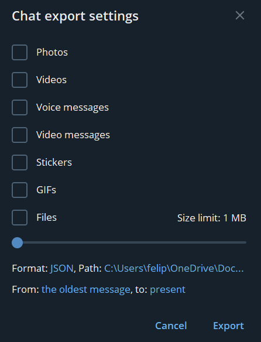

Fine-Tuning
============

Both the SFW and NSFW response models are adapters fine-tuned on top of the abliterated version of the ``gemma2-2b-it`` model, using a custom dataset based on public data of partner, volunteer Telegram chats.

The fine-tuning was done using the Hugging Face ``Trainer`` API, with the ``WandB`` library for logging. ``DVC`` was used to manage the dataset versioning. You can re-run the fine-tuning process using your own dataset.

Data Collection
----------------

.. warning::
   Only collect data from chats where all participants have explicitly consented to their messages being used for training purposes and are aware of the data collection. Collecting chat data without consent may violate privacy rights and terms of service!

To collect chat data from Telegram:

1. Open Telegram Desktop

2. Right-click on the chat you want to export

3. Select "Export chat history"

.. image:: _static/telegram1.png
   :alt: Telegram export settings
   :width: 20%
   :align: center

4. Choose JSON format in the export settings and set to save only text messages

5. Save SFW chats to ``data/SFW`` folder

6. Save NSFW chats to ``data/NSFW`` folder

The exported JSON files will contain the full chat history in a structured format suitable for processing.

Install Dependencies
---------------------

Install the Python libraries required for the fine-tuning process (assuming you have a working Python 3.10+ environment):

.. code-block:: bash

    # At the root of the project
    pip install -r requirements.txt

You will also need to install the Ollama CLI in order to upload the fine-tuned models to the model registry. Download the tool from the official website and follow their instructions depeding on your operating system.

Prepare Dataset
----------------

The dataset preparation uses DVC (Data Version Control) to manage the data pipeline. DVC is an open-source version control system for machine learning projects that allows tracking of data files, model files, and pipelines while keeping them outside of Git.

First, change to the training directory:

.. code-block:: bash

    cd training

Then run the DVC pipeline to process the data:

.. code-block:: bash

    dvc repro

This will execute two preprocessing scripts in sequence:

1. ``json2df.py`` - Converts the raw Telegram JSON exports into Parquet dataframes:
   
   * Processes all JSON files in ``data/SFW`` and ``data/NSFW`` folders
   * Extracts relevant message data like text, sender, timestamps
   * Combines messages from multiple chats
   * Saves as ``SFW.parquet`` and ``NSFW.parquet``

2. ``qa_pairs.py`` - Creates question-answer pairs from the conversations:
   
   * Identifies message replies to create context pairs
   * Groups consecutive messages from the same sender
   * Cleans the data by removing forwarded messages and bot messages
   * Creates parallel "query" and "response" columns
   * Saves as ``SFW_qa.parquet`` and ``NSFW_qa.parquet``

The resulting parquet files contain cleaned conversation pairs that will be used for fine-tuning the models. The DVC pipeline ensures reproducibility and tracks the data lineage, making it easy to rerun the preprocessing steps if the source data changes.

Fine-Tune Models
-----------------

On the ``finetune_llm.ipynb`` notebook, the fine-tuning process takes place. It uses the ``transformers`` library with PEFT (Parameter-Efficient Fine-Tuning) adapters. The base model ``IlyaGusev/gemma-2-2b-it-abliterated`` is loaded in 4-bit quantization to reduce memory usage:

.. code-block:: python

    from transformers import AutoModelForCausalLM, AutoTokenizer, BitsAndBytesConfig

    bnb_config = BitsAndBytesConfig(
        load_in_4bit=True,
        bnb_4bit_quant_type="nf4",
        bnb_4bit_compute_dtype="float16",
        bnb_4bit_use_double_quant=True
    )

    model = AutoModelForCausalLM.from_pretrained(
        "IlyaGusev/gemma-2-2b-it-abliterated", 
        quantization_config=bnb_config,
        device_map="auto"
    )

The LoRA adapter configuration used for both SFW and NSFW models:

.. code-block:: python

    lora_config = LoraConfig(
        r=8,  # Rank of the update matrices
        target_modules=["q_proj", "o_proj", "k_proj", "v_proj", 
                       "gate_proj", "up_proj", "down_proj"],
        task_type="CAUSAL_LM"
    )

The current fine-tuning process uses the following hyperparameters:

* Batch size: 1 with gradient accumulation of 16 steps
* Learning rate: 1e-5 with 15 warmup steps
* Training steps: 150
* Mixed precision: FP16
* Optimizer: PagedAdamW8bit

Training progress and metrics can be monitored in real-time through Weights & Biases:

- Log in to wandb.ai, get your key and include it in your .env file as ``WANDB_API_KEY``
- The training process will automatically log the metrics such as loss and gradient norms, as well as system logs, to Weights & Biases. Open the generated links in your browser to view them

After training, the LoRA adapters are saved to ``models/SFW/checkpoint-X`` and ``models/NSFW/checkpoint-X`` respectively. Then, they are merged with the base model and saved to ``models/SFW_merged`` and ``models/NSFW_merged`` respectively.

Upload Models
--------------

After fine-tuning, the models need to be uploaded to the Ollama registry. The process involves creating Modelfiles that specify the model configuration and using the Ollama CLI to create and push the models. Use the notebook ``push_to_ollama.ipynb`` to automate the process.

First, it will create Modelfiles for both SFW and NSFW models. You can modify the parameters to suit your needs:

.. code-block:: python

    modelfile_content = """
    FROM ../SFW_merged

    ADAPTER checkpoint-150

    PARAMETER temperature 0.7
    PARAMETER top_p 0.7
    PARAMETER stop "<|im_end|>"
    PARAMETER stop "<eos>"
    PARAMETER stop "<end_of_turn>"
    """

    with open("models/SFW/Modelfile", "w") as file:
        file.write(modelfile_content)

Then, it will fix the tokenizer JSON files to ensure compatibility with Ollama (this flattens the "merges" lists):

.. code-block:: python

    flatten_merges_in_json("models/SFW_merged/tokenizer.json", 
                          "models/SFW_merged/tokenizer.json")
    flatten_merges_in_json("models/NSFW_merged/tokenizer.json", 
                          "models/NSFW_merged/tokenizer.json")

Finally, it will create and push the models to Ollama:

.. code-block:: bash

    # Create and push SFW model
    cd models/SFW
    ollama create your-username/cookiebaker-sfw -f Modelfile
    ollama push your-username/cookiebaker-sfw

    # Create and push NSFW model
    cd ../NSFW
    ollama create your-username/cookiebaker-nsfw -f Modelfile
    ollama push your-username/cookiebaker-nsfw

.. note::
   You need to have the Ollama CLI installed and be logged in with your account before pushing the models. Replace ``your-username`` with your actual Ollama username.

Use Models
-----------

To use your fine-tuned models:

1. Edit the docker compose file to pull the new models (modify the command of x-init-ollama service)

2. Re-run the docker compose file. The new models will be available in the Ollama container.

3. Open the n8n workflow editor in your browser and update the model parameters of the ``SFW responder`` and ``NSFW responder`` nodes with the new model names from the dropdown menu.

4. Query the workflow from your client application and enjoy your new fine-tuned models!
